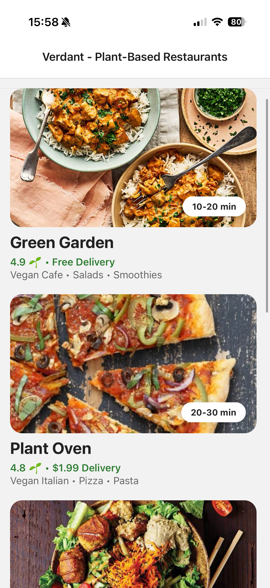

# Verdant



Verdant is a React Native prototype of a plant-based food delivery application developed as part of a Mobile Development university assignment. The project demonstrates mobile UI design, reusable components, navigation, and dynamic rendering of restaurant and menu data using React Native and Expo.

This application is **not** connected to a backend service and is **not intended for real food ordering**. All restaurants, menu items, images, prices, and availability are hard-coded for demonstration purposes.

---

## Features

- Browse multiple plant-based restaurants
- View restaurant details including:
    - Estimated delivery time
    - Rating
    - Delivery information
- Navigate between restaurant and menu screens
- Dynamically generated menus using reusable data structures
- Multiple menu categories per restaurant
- Menu item descriptions and pricing
- Out-of-stock items displayed as disabled
- Responsive layout built with reusable React components

---

## Technologies

- React Native
- Expo
- React Navigation
- react-native-tableview-simple

---

## Screens

### Home Screen

Displays a collection of vegetarian and vegan restaurants with:

- Restaurant image
- Name
- Cuisine
- Rating
- Delivery information
- Estimated delivery time

### Menu Screen

Displays restaurant menus grouped into categories with:

- Menu item name
- Description
- Price
- Availability status


---

## Project Structure

```
Verdant
│
├── assets
│   ├── images
│   ├── icon.png
│   └── splash.png
│
├── App.js
├── app.json
├── package.json
└── README.md
```

---

## Running the Project

Clone the repository:

```bash
git clone <repository-url>
```

Install dependencies:

```bash
npm install
```

Start the Expo development server:

```bash
npx expo start
```

Run the application using:

- Expo Go
- iOS Simulator
- Android Emulator

---

## Project Notes

This project was created as part of a university Mobile Development module.

The primary objective was to demonstrate:

- React Native fundamentals
- Component-based UI development
- Navigation between screens
- Dynamic rendering from structured data
- Mobile interface design

No authentication, payment processing, ordering system, or backend services are included.

---

## Future Improvements

Potential future enhancements include:

- Database integration
- User accounts
- Favorites
- Shopping cart
- Checkout flow
- Search and filtering
- Restaurant search by location
- Real-time menu updates
- Backend API integration

---

## Disclaimer

Verdant is an academic prototype created solely for educational purposes.

All restaurant names, menu items, prices, ratings, and availability shown within the application are fictional and are intended only to demonstrate user interface functionality.
